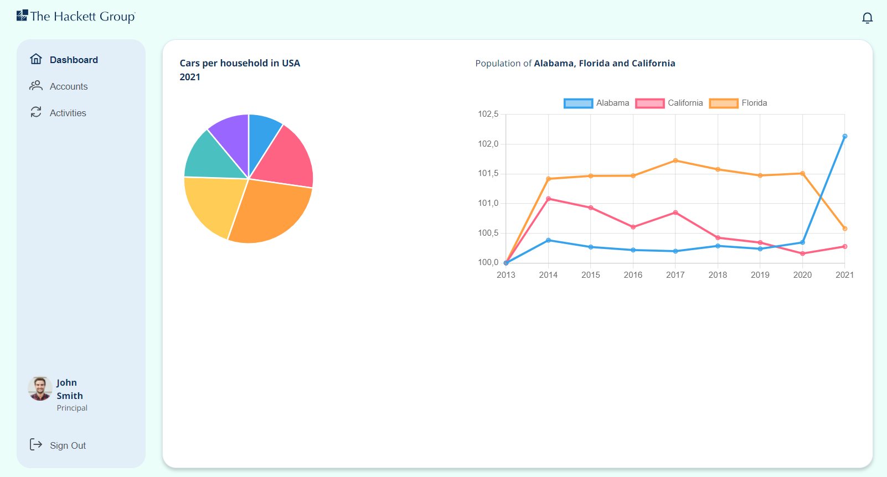
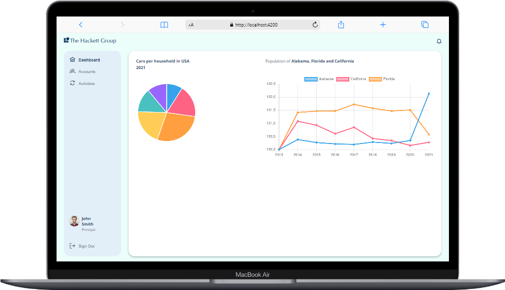
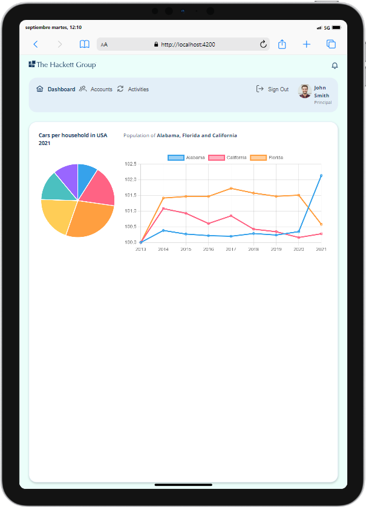
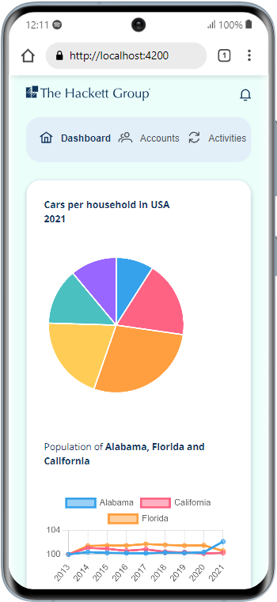
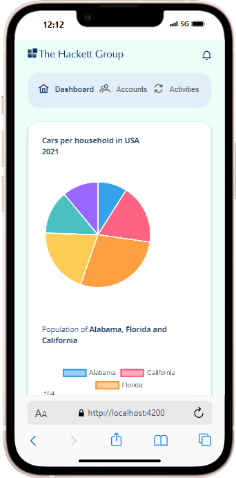

# THE HACKETT GROUP - FULLSTACK APP

#### Objective

The goal of this exercise is to build a full-stack application with an Angular frontend and a Django backend, integrating with the DataUSA API. The application visualizes two charts: a multi-axis line chart displaying population data and a pie chart displaying vehicle ownership data. The backend should expose a GraphQL API with two resolvers and serve the frontend's static distribution files.

## Approach

This project follows a modular structure, ensuring separation of concerns between the frontend and backend. The frontend is implemented using Angular and serves two components representing two distinct charts. The backend is implemented in Django and acts as a GraphQL intermediary, connecting to the DataUSA API and serving population and vehicle ownership data.

The application is developed with scalability and maintainability in mind, ensuring that any future modifications to the data sources or frontend can be easily implemented.

## Implementation Details

### Frontend (Angular)

 Arquitecture: Clean arquitecture
 Framework: Angular 18 (using standalone APIs, without AppModule and signals).
 Libraries:

- chart.js and ng2-charts is used for chart rendering.
- apollo-angular is used for GraphQL integration with the backend.

- @ngx-env/builder for manage environment variables (with ci/cd)
- eslint and prettier for code quality

 Components (#main):

- PopulationChartComponent: Displays a multi-axis line chart with population data from Alabama, Florida, and California (2013–2021).
- VehicleOwnershipChartComponent: Displays a pie chart showing US household vehicle ownership distribution for 2021.

 Responsiveness:
The application is designed to be responsive, ensuring compatibility across different devices and screen sizes. It uses the Open Sans font as specified in the graphic template.

 Services:
#### Backend (Django + GraphQL)
 Framework: Django with graphene-django for GraphQL API implementation.
 Resolvers:
- Population Data Resolver: Fetches population data for Alabama, Florida, and California for the years 2013–2021.
- Vehicle Ownership Resolver: Retrieves vehicle ownership data for US households in 2021.

 Static File Serving: The Angular build output is served via Django at "/" endpoint, allowing the frontend to be accessible from the same server and is configured to support angular routing.
